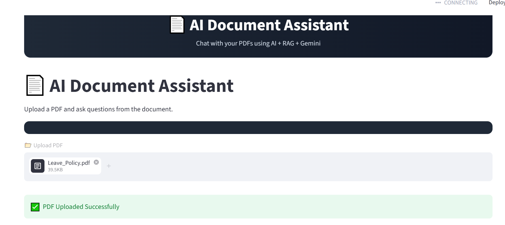
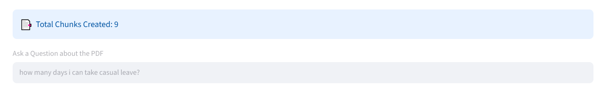
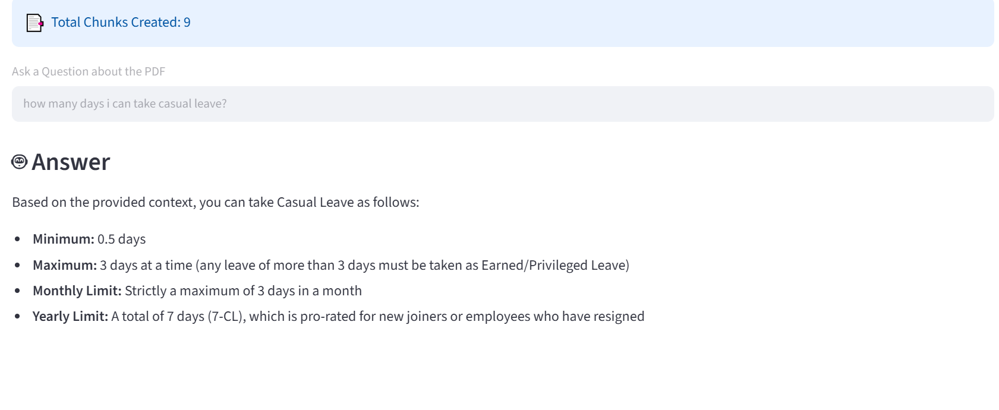

# 📄 AI Document Assistant

An AI-powered Document Question Answering system built using **RAG (Retrieval-Augmented Generation)**, **LangChain**, **ChromaDB**, **Google Gemini**, and **Streamlit**.

Upload PDF documents and ask questions in natural language. The system retrieves the most relevant document chunks and generates accurate answers using Gemini AI.

---

## 🚀 Features

✅ PDF Upload Support

✅ Intelligent Document Search using RAG

✅ Google Gemini Integration

✅ ChromaDB Vector Database

✅ Semantic Search with Embeddings

✅ Clean and Modern Streamlit UI

✅ Real-time Question Answering

✅ Context-Aware Responses

✅ Source Retrieval from Documents

---

## 🛠️ Tech Stack

| Technology | Purpose |
|------------|----------|
| Python | Backend Development |
| Streamlit | User Interface |
| LangChain | RAG Pipeline |
| ChromaDB | Vector Database |
| Gemini API | Large Language Model |
| HuggingFace Embeddings | Text Embeddings |
| PyPDFLoader | PDF Processing |

---

## 📂 Project Structure

```text
AI-Document-Assistant/
│
├── app.py
├── requirements.txt
├── .env
├── README.md
│
├── chroma_db/
│
├── images/
│   ├── home.png
│   ├── chunk.png
│   └── QA.png
│
└── data/
```

---

## ⚙️ Installation

### Clone Repository

```bash
git clone https://github.com/eswarrithik/AI-Document-Assistant.git

cd AI-Document-Assistant
```

### Create Virtual Environment

```bash
python -m venv .venv
```

### Activate Environment

#### Windows

```bash
.venv\Scripts\activate
```

#### Mac/Linux

```bash
source .venv/bin/activate
```

### Install Dependencies

```bash
pip install -r requirements.txt
```

---

## 🔑 Environment Variables

Create a `.env` file:

```env
GOOGLE_API_KEY=YOUR_GEMINI_API_KEY
```

Get your API key from:

https://aistudio.google.com

---

## ▶️ Run Application

```bash
streamlit run app.py
```

---

# 📸 Application Screenshots

## 🏠 Home Page



---

## 📑 Document Chunking



---

## 🤖 Question Answering



---

## 🔄 How It Works

### Step 1

Upload a PDF document.

### Step 2

PDF content is extracted using PyPDFLoader.

### Step 3

Text is split into chunks.

### Step 4

Embeddings are generated using:

```text
sentence-transformers/all-MiniLM-L6-v2
```

### Step 5

Embeddings are stored in ChromaDB.

### Step 6

Relevant chunks are retrieved.

### Step 7

Gemini generates an answer using retrieved context.

---

## 📈 Future Improvements

- Multi-PDF Chat
- Conversation Memory
- Source Citations
- PDF Preview Panel
- Download Answers as PDF
- Authentication System
- Deployment on Cloud

---

## 🎯 Resume Project Description

**AI-Powered Document Assistant using RAG**

Built an intelligent document question-answering system using LangChain, ChromaDB, Google Gemini, and Streamlit. Implemented Retrieval-Augmented Generation (RAG) to retrieve relevant PDF content and generate context-aware responses. Developed semantic search using vector embeddings and optimized document retrieval for accurate AI-generated answers.

---

## 👨‍💻 Author

### Eswar Rithik

GitHub:

https://github.com/eswarrithik

LinkedIn:

(Add your LinkedIn profile URL)

---

## ⭐ If you found this project useful, consider giving it a Star.
